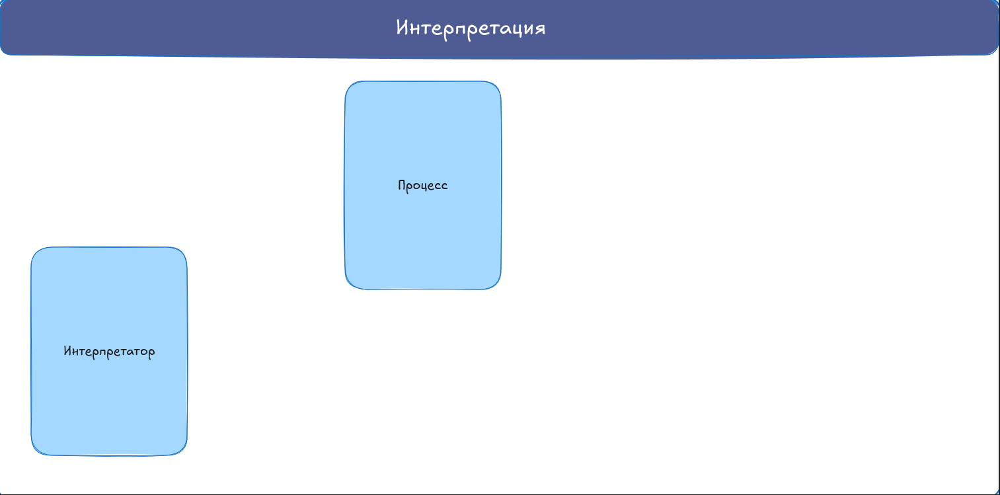
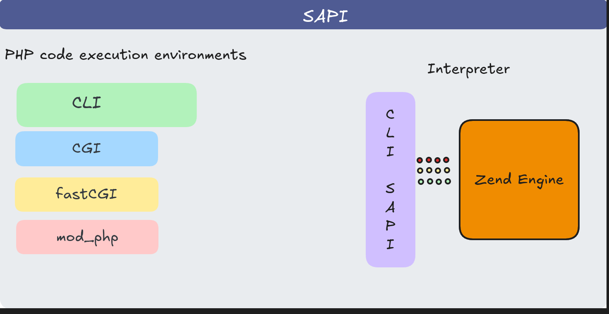

# Карта мира PHP 🐘

## Введение
Около десяти лет назад я задался вопросом: а что такое PHP? То есть как реально устроен инструмент. В тот момент опыт в программировании у меня был очень поверхностный. Но для меня есть связь между комфортом использования инструмента и глубиной понимания его устройства. По этому я взялся копать.
В процессе использования языка и размышлений о нём у меня сложился определённый пазл.
И так...
У нас есть:

### 1. Классическая ситуация. Компилируемые языки.
```bash
Исходный код на ЯП → Компилятор → Исполняемый файл (программа) → Запущенный процесс (исполняющий инструкции программы в контексте данных программы). 
```

### 2. Альтернативный подход. Интерпретируемые языки.
В контексте классики может показаться, что PHP — не язык программирования, так как не существует исполняемого файла-программы, являющегося результатом компиляции кода на PHP. Для программиста даже не существует компилятора PHP-кода (хотя он есть, но работает в другом месте схемы и запускается автоматически). То есть особенность в том, что интерпретируемые языки просто меняют классическую схему.

```bash
Исходный код на ЯП → Интерпретатор (это готовая к исполнению программа, сама по себе ничего полезного нам не дающая, но имеющая набор средств для интерпретации кода на PHP. Именно тут, в интерпретаторе, есть компилятор PHP-кода. В этом случае компилятор — часть интерпретатора) → Процесс (в этом случае в ОС запущен именно процесс интерпретатора, в который передаются инструкции на языке PHP. Интерпретация этих инструкций наполняет процесс описанной в PHP-коде логикой).
```
<p align="center">
  
</p>


*То есть это просто иная схема.*

Нет автономного исполняемого файла, но есть финальный смысловой результат — процесс.
Процесс самостоятельно преобразует код на PHP в набор инструкций и данных, с которыми будет работать процессор.

Резюме.
PHP-код сам по себе не превращается в отдельный бинарник, он всегда исполняется внутри процесса интерпретатора. Интерпретатор — программа, которая сама по себе содержит только внутреннюю техническую логику. Бизнес-логику она получает из PHP-кода.

## Нужно больше ~~золота~~ знаний

Но этого явно мало. Хочется больше деталей. Попробуем составить смысло-логический список сущностей для будущей карты.

PHP это:
### **Язык.** 
Набор правил для интерпретатора (описанных в неформальной спецификации php.net/manual/en/). 

### **Интерпретатор.**
В широком смысле — совокупность программных средств, написанных на C, позволяющая:

- принять сценарий и данные для него,
- интерпретировать и выполнить описанное в сценарии.

То есть у интерпретатора есть 3 основных слоя:
```bash
1. Интерфейс SAPI -> 2. Движок Zend Engine -> 3. Система расширения функций движка 
```

!КАРТИНКА!

#### 1. SAPI (Server API) 
<p align="center">
  
</p>
Это интерфейс, через который ядро PHP (Zend Engine) взаимодействует с внешним миром.

Внешний мир это:
- процесс, который вызывает интерпретатор PHP (или в который он встроен),
- и протокол/механизм обмена данными, который этот процесс предполагает.

Его принято называт средой исполнения. Существуют разные среды исполнения PHP-кода (например, CLI или FastCGI). Каждая среда по-своему обменивается данными с процессом PHP, используя собственный протокол.

Чтобы ядро работало одинаково, независимо от среды, существуют различные реализации SAPI. Они преобразуют входящие данные в формат, который понимает ядро, и, наоборот, ответы ядра — в формат, понятный конкретной среде выполнения.

SAPI — это посредник: ядро не думает о среде, а среда — о ядре. Каждый говорит на своём языке, а SAPI обеспечивает взаимопонимание.

*На практике: для запуска PHP-кода в консоли используют бинарь php-cli, который скомпилирован с sapi cli, а для работы через FastCGI — php-fpm который скомпилирован с sapi fpm и т. д.*

**Наиболее часто встречающиеся среды исполнения PHP и их протоколы/механизмы обмена данными:**

- CLI SAPI. Использутся для запуска интерпретатора в терминале. Терминал делает системный вызов ОС php и передаёт данные через STDIN (поток ввода), переменные окружения и параметры (аргументы) команды. CLI SAPI способно принять данные в таком формате и преобразовать их в удобоваримые для ядра. 

- CGI SAPI. Среда передает данные через :
    - переменные окружения, в которые она складывает HTTP-заголовки (в том числе и query-параметры),
    - поток ввода STDIN, в который среда выполнения (веб-сервер) направляет тело HTTP-запроса.  
    - аргументы вызова, куда кладётся только имя исполняемого файла.
CGI SAPI способно принять данные в таком формате и преобразовать их в удобоваримые для ядра.
    
- FPM SAPI. Это уже более сложная система: демон + пул воркеров + протокол FastCGI.
Если кратко, то внутри демона работает мастер-процесс, который запускает пул воркеров
(каждый содержит Zend Engine + расширения), распределяет запросы и возвращает ответы по протоколу FastCGI. 
Ключевая разница с CLI или CGI в том, что процесс php-fpm работает в режиме демона, а не просто
 ```bash 
вызывается -> выполняется -> умирает
 ```
как в случае CLI или CGI.

Здесь среда выполнения — это веб-сервер, который передаёт данные по протоколу FastCGI. Там содержатся упакованные данные с HTTP-заголовками и телом запроса. FPM SAPI способно принять данные в таком формате и преобразовать их в удобоваримые для ядра.

- mod_php (Apache). Здесь данные передаются ядру PHP, встроенному в запущенный процесс Apache, по внутренним протоколам Apache. 

В репозитории с [исходным кодом php](https://github.com/php/php-src/tree/master) есть директория sapi, в которой расположены доступные при сборке SAPI. 

```bash
 sapi/cli/
 sapi/cgi/
 sapi/fpm/
 sapi/apache2handler/
 ... 
 ```

 #### 2. Ядро (Zend Engine)

 Оно отвечает за:

- разбор исходного кода (парсинг → AST),
- компиляцию AST в опкоды (байткод PHP),
- исполнение этих опкодов.

В узком смысле слова ядро (Zend Engine) и есть интерпретатор. То есть это мозг и руки интерпретатора. 

#### 3. Набор расширений

Существует специальная система модульного расширения функционала ядра Zend Engine.
Extensions — это расширения, которые собираются вместе с ядром и SAPI в бинарник. Другие расширения могут подключаться отдельно как динамические модули (.so) через php.ini к уже скомпилированному интерпретатору. То есть подключаться в процессе запуска, а не компиляции интерпретатора.

Тему расширений мы тоже затронем достаточно детально. Но не сейчас.

#### Резюме по интерпретатору
Финальный вид интерпретатора — это, как правило, скомпилированный из исходников бинарный файл.
Существует несколько основных видов скомпилированных интерпретаторов:
- php (CLI-бинарник),
- php-cgi (CGI-бинарник),
- mod_php (динамический модуль для Apache, а не отдельный бинарник),
- php-fpm (демон с FastCGI).

Иными словами, это результат компиляции ядра (Zend Engine) и его расширений с различными вариантами SAPI.

*Вариант ядра один, а вот интерфейсов для его запуска — несколько.*

## Общий план тем (Карта)

Сейчас, осознав теоретическую концепцию, я предлагаю умозрительно отдалить взгляд от частного к общему.
Возникает такая карта:
<p align="center">
  
</p>

1. Инфраструктура и логика применения в разных средах:
    - CLI: скрипты, cron, консольные утилиты (текст)
    - Веб ("классика" — в связке с веб-серверами): CGI, Apache+mod_php, php-fpm + nginx/Apache
    - Веб (альтернативные способы): встроенный сервер PHP, асинхронные решения (RoadRunner, AMPHP, Swoole)

2. Расширение возможностей PHP
    - Логика работы с функционалом расширения ядра
    - Установка пакетов для приложения (Composer, экосистема библиотек)

3. Как запускается код
    - Этапы исполнения (парсинг → AST → байткод → выполнение)
    - Способы ускорения и оптимизации (OpCache, JIT, кеширование)

4. Как пишем код
    - Основные приёмы и паттерны для прикладных задач

5. Фреймворки
    - Общая картина и Laravel как частный пример
    - Создание пакетов/расширений для Laravel


А я в этой серии буду словно в RPG, где перед нами карта с областями, и можно выбрать, куда отправиться.  
Строгого порядка следования не будет. Это скучно, да и лишено смысла. Ибо все темы самодостаточные, и на разном этапе вашей профессиональной деятельности могут быть разные интересы.  
А учитывая, что есть карта, каждый сам сможет выбирать стартовые точки и направления, исходя из своих интересов.  

## Finaly
Вот это всё — картина внутреннего устройства PHP. Но в качестве вишенки на торте давайте отдалимся от PHP, чтобы увидеть ещё более глобальную карту.  
PHP — лишь часть экосистемы, которая существует в большом пространстве ОС. 

*Это лишь одна из рыбок в большом аквариуме ОС.*

Пространство операционной системы гораздо больше, чем PHP. На карте ОС PHP — лишь одна из областей, и то необязательная. Но это не умаляет значимости PHP. 
На этой технологии работает существенная часть бизнеса.  

То есть фундаментально работа ведётся внутри ОС. Она работает на железном сервере. Внутри ОС (как правило, из семейства Linux) одной из технологий будет какой-то веб-сервер, который принимает сообщения из внешнего мира по сети. За спиной этого веб-сервера работает PHP, который в основном используется в качестве связующего звена между веб-сервером и СУБД.  Хотя в качестве этого звена нередко выступают и другие серверные языки.

То есть главное "поле битвы" — ОС. А в ней уже конфигурируются наборы из технологий. И работают эти технологии по законам ОС.  
Мы в этой серии преимущественно будем говорить о PHP. Но, возможно, местами придётся выходить за рамки — для ясности.  
 