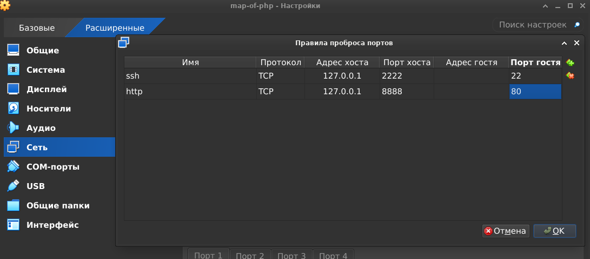

# Карта мира PHP 🐘

## Введение

(слайд 1)

Около десяти лет назад я задался вопросом: а что такое PHP? То есть, а как реально устроен этот инструмент? В тот момент опыт в программировании у меня был очень поверхностный. Но для меня есть связь между комфортом использования инструмента и глубиной понимания его устройства. По этому я взялся копать.
В процессе использования языка и размышлений о нём у меня сложился определённый пазл.
Итак...
У нас есть:

### 1. Классическая ситуация. Компилируемые языки.

(слайд 2)

```bash
Исходный код на ЯП → Компилятор → Исполняемый файл (программа) → Запущенный процесс (исполняющий инструкции программы в контексте данных программы). 
```

### 2. Альтернативный подход. Интерпретируемые языки.
В контексте классики может показаться, что PHP — не язык программирования, так как не существует исполняемого файла-программы, являющегося результатом компиляции кода на PHP. (слайд 9) Для программиста даже не существует компилятора PHP-кода (хотя он есть, но работает в другом месте схемы и запускается автоматически). То есть особенность в том, что интерпретируемые языки просто меняют классическую последовательность действий. 
У нас есть:

(слайд 10) Начинается все с запуска интерпретатора. 

> **Интерпретатор** - это готовая к исполнению программа, сама по себе ничего полезного нам не дающая, но имеющая набор средств для интерпретации кода на PHP. Именно тут, в интерпретаторе, есть компилятор PHP-кода. В этом случае компилятор — часть интерпретатора) (слайд 11).

(слайд 12) Ему (интерпретатору) передается путь к файлу с исходным кодом на PHP. (слайд 13) Который содержит бизнес логику. Пройдя ряд преобразований (в том числе и компиляцию), он исполнится в этом процессе интерпретатора.

Тут важно уловить, что ОС запускает именно процесс интерпретатора. То есть реально работает программа на Си которая принимает путь к исходному коду на PHP и считывает его. Эта программа (интерпретатор) преобразовует этот код в некое подобие бинарника, а потом там же в памяти процесса исполняет его, при помощи виртуальной машины Zend Engine.  

*То есть это просто иная схема исполнения.*

> Нет автономного исполняемого файла, но есть финальный смысловой результат — процесс.
>
> Процесс интерпретатора самостоятельно преобразует код на PHP в набор инструкций и данных, с которыми будет работать процессор.

(слайд 14)
Резюме:

1. PHP-код сам по себе не превращается в отдельный бинарник, он всегда исполняется внутри процесса интерпретатора.
2. Интерпретатор — программа, которая сама по себе содержит только внутреннюю техническую логику. Бизнес-логику она получает из PHP-кода.

(слайд 15)
## Нужно больше ~~золота~~ знаний

Но этого явно мало. Хочется больше деталей. Попробуем составить смысло-логический список сущностей для будущей карты.

PHP это:
(слайд 16)
### **Язык.** 
Набор правил, по составлению исходного кода пригодного для интерпретатора PHP. Они описанны в неформальной спецификации php.net/manual/en/.(слайд 17) 

(слайд 18)
### **Интерпретатор.**
В широком смысле — совокупность программных средств, написанных на C, позволяющая:

- принять сценарий и данные для него,
- интерпретировать и выполнить описанное в сценарии.

(слайд 19) 
#### Три основных компонента интерпретатора:
```bash 
1. (слайд 20) Интерфейс SAPI -> 2. (слайд 21) Движок Zend Engine -> 3. (слайд 22) Система расширения функций движка 
```

##### 1. SAPI (Server API) 

(слайд 23) Это интерфейс, через который ядро PHP (Zend Engine) взаимодействует с внешним миром.

Внешний мир это : (слайд 24)
- процесс, который вызывает интерпретатор PHP (или в который он встроен),
- и протокол/механизм обмена данными, который этот процесс предполагает.

Его (внешний мир), принято называт средой исполнения. Она вызывает и она ждет код ответа. Существуют разные среды исполнения PHP-кода (например, CLI или FastCGI). Каждая среда по-своему обменивается данными с процессом PHP, используя собственный протокол.

Чтобы ядро работало одинаково, независимо от среды, существуют различные реализации SAPI. Они преобразуют входящие данные в формат, который понимает ядро, и, наоборот, ответы ядра — в формат, понятный конкретной среде выполнения.

SAPI — это посредник: ядро не думает о среде, а среда — о ядре. Каждый говорит на своём языке, а SAPI обеспечивает взаимопонимание.

*На практике: для запуска PHP-кода в консоли используют бинарь php-cli, который скомпилирован с sapi cli, а для работы через FastCGI — php-fpm который скомпилирован с sapi fpm и т. д.*

(слайд 25) 
###### Наиболее распространенные SAPI PHP и детали их работы:

- **CLI SAPI.** 

Использутся для запуска интерпретатора в терминале. После того как мы в терминале выполнили команду типа
```bash
php index.php
```
Shell парсит строку php index.php и понимает что нужно запустить бинарь /usr/bin/php.

После чего он формирует массив аргументов (по стандарту POSIX):
```c
argv[0] = "php";        // всегда имя исполняемого файла
argv[1] = "index.php";  // первый аргумент
argv[2] = NULL;         // конец массива
```
Следующим шагом оболочка Shell вызывает системный вызов fork(). В следствии чего ОС делает копию процесса shell (новый дочерний процесс).

В копию дублируются: переменные окружения, файловые дескрипторы.

Далее в дочернем процессе shell вызывает execve("/usr/bin/php", argv, envp).
Это приводит к тому, что ОС замещает память процесса (сегменты TEXT, DATA, HEAP, STACK) данными и инструкциями из бинарника и устанавливает переменные окружения переданные из envp и argv. В итоге в новом процессе есть:
- скопированные у родителя файловые дескрипторы,
- переменые окружения из envp,
- аргументы командной строки из argv. 

**👉 На этом этапе процесс перестаёт быть shell и становится процессом php.**

cli sapi внутри процесса готово брать именно такой формат данных. То есть, когда ОС запускает этот дочерний процесс на исполнение cli sapi возмет переменные окружения и stdin процесса и сделает их доступными в теле скрипта на php, через набор суперглобальных массивов.  


*У меня есть еще один материал, с разбором разницы между программой и процессом. Этот материал может дополнить картину новыми деталями. Как только я его запишу, то постараюсь прикрепить сюда ссылку. (Если ссылки нет, то возможно я просто еще его не залил. Подождите немного или напомните в коментариях, и я дам обратную связь по этому вопросу).*   

- **CGI SAPI.** 
Тут процесс иной.
Клиент делает HTTP-запрос. Веб-сервер (во времена использования CGI это был преимущественно Apache) принимает его.
Веб сервер парсит запрос. В результате делит его на две части:
1. Стартовая строка и заголовки. Их значения он устанавливает в переменные окружения (например: QUERY_STRING, REQUEST_METHOD, CONTENT_TYPE, CONTENT_LENGTH, HTTP_USER_AGENT, HTTP_COOKIE и т. д.). 
2. Тело запроса если оно есть. Тело запроса он сохраняет у себя в буфере. 


Далее сервер делает pipe канал. Потом вызывает fork(), с тойже целью как и при консольном запуске. 
В дочернем процессе (ещё до execve()) он делает `dup2(pipefd[0], STDIN_FILENO)`.

*👉 Это значит: «замени стандартный ввод на читающий конец pipe».*

Создает массивы argv, envp и наполняет их.
Вызывает execve("/usr/bin/php-cgi", argv, envp).
Потом веб сервер в родительском процессе записывает в pipe тело HTTP-запроса.
Дочерний процесс (php-cgi) просто читает STDIN — и получает данные тела запроса.

> Важно запомнить!
>
> У CGI-протокола есть жёсткое правило:

> - STDIN дочернего процесса = тело HTTP-запроса.
> - STDOUT дочернего процесса = HTTP-ответ, который Apache потом вернёт клиенту.

Как результат, получается что cgi sapi выполнит туже  работу что и в случае cli sapi.
Возмет переменные окружения и stdin процесса и сделает их доступными в теле скрипта на php.  
#==============
Среда передает данные через :
    - переменные окружения, в которые она складывает HTTP-заголовки (в том числе и query-параметры),
    - поток ввода STDIN, в который среда выполнения (веб-сервер) направляет тело HTTP-запроса.  
    - аргументы вызова, куда кладётся только имя исполняемого файла.
CGI SAPI способно принять данные в таком формате и преобразовать их в удобоваримые для ядра.
#===============    
-  **FPM SAPI**. 
Это уже более сложная система: демон + пул воркеров + протокол FastCGI.
Если кратко, то внутри демона работает мастер-процесс, который запускает пул воркеров
(каждый содержит Zend Engine + расширения), распределяет запросы и возвращает ответы по протоколу FastCGI. 
Ключевая разница с CLI или CGI в том, что процесс php-fpm работает в режиме демона, а не просто
 ```bash 
вызывается -> выполняется -> умирает
 ```
как в случае CLI или CGI.

Здесь среда выполнения — это веб-сервер, который передаёт данные по протоколу FastCGI. Там содержатся упакованные данные с HTTP-заголовками и телом запроса. FPM SAPI способно принять данные в таком формате и преобразовать их в удобоваримые для ядра.

- **mod_php (Apache).** 
Здесь данные передаются ядру PHP, встроенному в запущенный процесс Apache, по внутренним протоколам Apache.

> Важно!
> 
> 1. SAPI можно воспринимать глазами разработчика на PHP. Это разные комбинации суперглобальных массивов, через которые разработчик получает доступ к входящим данным. Эти комбинации отличаются от SAPI к SAPI.
> 2. Также важно осозновать что SAPI не только создает суперглобали для разработчика но и управляет жизненным циклом ядра. 
> SAPI вызывает startup-фазы ядра (php_module_startup).
> SAPI решает, как именно обрабатывать запрос:
>
> - в CLI — один вызов → запуск скрипта → завершение,
> - в CGI — один запрос = один процесс → запуск скрипта → завершение,
> - в FPM — процесс живёт долго, обрабатывает много запросов, и для каждого SAPI вызывает «start request → run → end request».
> - Когда интерпретатор отработал, SAPI вызывает shutdown-фазы ядра (php_module_shutdown). Закрываются ресурсы, чистится память, сбрасываются буферы.

> - В CGI/CLI процесс завершается, в FPM — остаётся жить до следующего запроса.  

=========================================================================================================================================

В репозитории с [исходным кодом php](https://github.com/php/php-src/tree/master) есть директория sapi, в которой расположены доступные при сборке SAPI. 

```bash
 sapi/cli/
 sapi/cgi/
 sapi/fpm/
 sapi/apache2handler/
 ... 
 ```

 ##### 2. Ядро (Zend Engine)

 Оно отвечает за:

- разбор исходного кода (парсинг → AST),
- компиляцию AST в опкоды (байткод PHP),
- исполнение этих опкодов.

В узком смысле слова ядро (Zend Engine) и есть интерпретатор. То есть это мозг и руки интерпретатора. 

##### 3. Набор расширений

Существует специальная система модульного расширения функционала ядра Zend Engine.
Extensions — это расширения, которые собираются вместе с ядром и SAPI в бинарник. Другие расширения могут подключаться отдельно как динамические модули (.so) через php.ini к уже скомпилированному интерпретатору. То есть подключаться в процессе запуска, а не компиляции интерпретатора.

Тему расширений мы тоже затронем достаточно детально. Но не сейчас.

#### Резюме по интерпретатору
Финальный вид интерпретатора — это, как правило, скомпилированный из исходников бинарный файл.
Существует несколько основных видов скомпилированных интерпретаторов:
- php (CLI-бинарник),
- php-cgi (CGI-бинарник),
- mod_php (динамический модуль для Apache, а не отдельный бинарник),
- php-fpm (демон с FastCGI).

Иными словами, это результат компиляции ядра (Zend Engine) и его расширений с различными вариантами SAPI.

*Вариант ядра один, а вот интерфейсов для его запуска — несколько.*

## Общий план тем (Карта)

Сейчас, осознав теоретическую концепцию, я предлагаю умозрительно отдалить взгляд от частного к общему.
Возникает такая карта:
<p align="center">
  
</p>

1. Инфраструктура и логика применения в разных средах:
    - CLI: скрипты, cron, консольные утилиты (текст)
    - Веб ("классика" — в связке с веб-серверами): CGI, Apache+mod_php, php-fpm + nginx/Apache
    - Веб (альтернативные способы): встроенный сервер PHP, асинхронные решения (RoadRunner, AMPHP, Swoole)

2. Расширение возможностей PHP
    - Логика работы с функционалом расширения ядра
    - Установка пакетов для приложения (Composer, экосистема библиотек)

3. Как запускается код
    - Этапы исполнения (парсинг → AST → байткод → выполнение)
    - Способы ускорения и оптимизации (OpCache, JIT, кеширование)

4. Как пишем код
    - Основные приёмы и паттерны для прикладных задач

5. Фреймворки
    - Общая картина и Laravel как частный пример
    - Создание пакетов/расширений для Laravel


А я в этой серии буду словно в RPG, где перед нами карта с областями, и можно выбрать, куда отправиться.  
Строгого порядка следования не будет. Это скучно, да и лишено смысла. Ибо все темы самодостаточные, и на разном этапе вашей профессиональной деятельности могут быть разные интересы.  
А учитывая, что есть карта, каждый сам сможет выбирать стартовые точки и направления, исходя из своих интересов.  

## Finaly
Вот это всё — картина внутреннего устройства PHP. Но в качестве вишенки на торте давайте отдалимся от PHP, чтобы увидеть ещё более глобальную карту.  
PHP — лишь часть экосистемы, которая существует в большом пространстве ОС. 

*Это лишь одна из рыбок в большом аквариуме ОС.*

Пространство операционной системы гораздо больше, чем PHP. На карте ОС PHP — лишь одна из областей, и то необязательная. Но это не умаляет значимости PHP. 
На этой технологии работает существенная часть бизнеса.  

То есть фундаментально работа ведётся внутри ОС. Она работает на железном сервере. Внутри ОС (как правило, из семейства Linux) одной из технологий будет какой-то веб-сервер, который принимает сообщения из внешнего мира по сети. За спиной этого веб-сервера работает PHP, который в основном используется в качестве связующего звена между веб-сервером и СУБД.  Хотя в качестве этого звена нередко выступают и другие серверные языки.

То есть главное "поле битвы" — ОС. А в ней уже конфигурируются наборы из технологий. И работают эти технологии по законам ОС.  
Мы в этой серии преимущественно будем говорить о PHP. Но, возможно, местами придётся выходить за рамки — для ясности.  
 