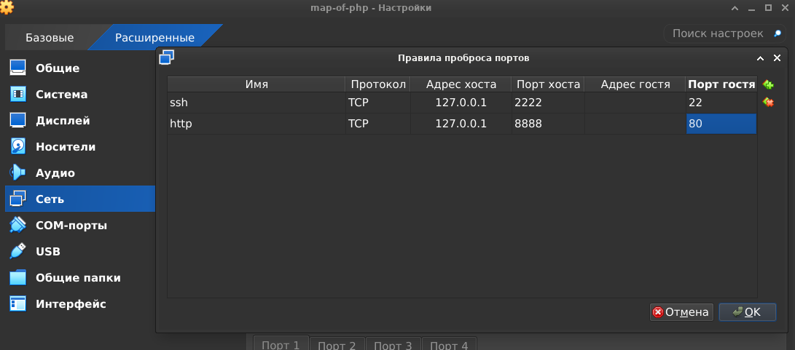
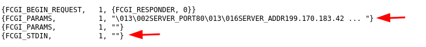

# PHP под капотом 🐘 (Карта мира PHP)

## Введение
(Слайд № 1)
Привет всем, заглянувшим.
Это первое вступительное видео из серии «Собирая пазл PHP».

Оно будет состоять из двух частей — теоретической и практической.

Его цель — собрать ментальную карту смысловых сущностей, из которых состоит мир `PHP`,
а затем исследовать каждую из них отдельно,
при этом чётко понимая её место в глобальной картине.

В общем, нам нужна база — но не про «коробочки с переменными»,
а чётко описывающая, как работает технология и из каких элементов она состоит.

На первый взгляд этот материал может показаться не слишком полезным с практической точки зрения,
но это не так.
Фундаментальное понимание принципов работы технологии прокладывает путь
от магического мышления к инженерной ясности.
Это переход от метода научного тыка к осознанному творчеству —
то есть от любителя к инженеру.

Если говорить обо мне, то около десяти лет назад у меня впервые появился вопрос:
а что такое `PHP`?

Мне захотелось понять общую картину, но с достаточно высоким уровнем детализации.
Официальная документация, хоть и является одной из лучших, но не удовлетворила мой запрос в полной мере,
поэтому я начал собирать этот пазл самостоятельно, параллельно используя `PHP` в своей работе.

Именно этот пазл мы и будем собирать вместе в этой серии.

А начнём мы с того, что посмотрим на упрощённую схему работы компилируемых и интерпретируемых языков.

### 1. Классическая схема. Компилируемые языки. [Пропуск]

(Слайд №2)
Тут мы видим, что у нас есть:

```bash
Исходный код на ЯП (например `C` или `Go`) → Компилятор 
```

Мы можем передать исходный код компилятору (Слайд № 3).
Компилятор проведёт преобразования и получит бинарный файл (Слайд № 4).
Этот файл будет возвращён компилятором в качестве результата своей работы (Слайд № 5).
В итоге у нас на диске будет бинарник, он же программа — то есть файл, который можно запустить на исполнение в ОС (Слайд № 6).
Если мы запустим на исполнение этот файл, то получим процесс, исполняющий инструкции этой программы в контексте её данных (Слайд № 7).

То есть схему можно описать так:

```bash
код → компилятор → программа → процесс.
```
Главное, на что тут нужно обратить внимание, — это то, что исходный код на `C` или `Go` после компиляции становится самостоятельной программой, которую можно запустить.

А теперь посмотрим на схему работы, используемую в мире интерпретируемых языков, на примере `PHP`.

> **Дополнительная информация!**
>
> Процесс — это активная сущность: программа в состоянии исполнения.  
> Но на уровне ядра, процесс — это структура данных, описывающая всё, что нужно,  
> чтобы программа могла исполняться (или быть готовой к исполнению).  
> Я планирую записать видео о разнице между процессом и программой. Как только сделаю это, добавлю ссылку в закрепленный комментарий.   

### 2. Альтернативный подход. Интерпретируемые языки. [Пропуск]

(Слайд № 8)  
На фоне компилируемых языков может показаться, что `PHP` — не совсем язык программирования,  
так как не существует программы (то есть исполняемого бинарника), которая скомпилирована из PHP-кода.

(Слайд № 9)  
Для PHP-программиста даже не существует понятия «компилятор PHP-кода».  
То есть здесь явно используется иная последовательность действий.  

Давайте на неё посмотрим.

(Слайд № 10)  
Первым в этой схеме запускается интерпретатор.

Для ясности определимся с понятиями.

**Интерпретатор** — готовая к исполнению программа, написанная на C.  
Эта программа умеет интерпретировать и выполнять алгоритм, описанный на языке `PHP`.  

(Слайд № 11)  
После запуска интерпретатора появляется процесс, в котором исполняются инструкции интерпретатора в контексте его данных.  

Интерпретатор получит путь к файлу (Слайд № 12),  
в котором описан алгоритм на языке `PHP` (Слайд № 13).  

Выполнит наш алгоритм и вернёт строковый результат в поток stdout.  

**Тут важно уловить, что операционная система запускает именно процесс интерпретатора.**  
**То есть реально работает программа, написанная на C и скомпилированная в исполняемый бинарник.**  
**Она принимает путь к исходному коду на `PHP` и считывает его.**  
**Далее преобразует его в некое подобие бинарника внутри себя.**  
**То есть она парсит исходный код, преобразует его в абстрактное синтаксическое дерево и компилирует всё это в опкоды.**  
**А затем прямо внутри себя исполняет их.**  
**Это просто иная схема исполнения: нет автономного исполняемого файла (программы), но есть финальный смысловой результат — процесс.**  
**И прикладная логика / алгоритм, исполняемый этим процессом, описана на языке программирования `PHP`.**  
**То есть PHP-код не становится программой — он становится инструкциями для другой программы.**

Подведём итог:

(Слайд № 14)
1. PHP-код сам по себе не превращается в отдельный бинарник (программу) — он всегда исполняется внутри процесса интерпретатора.  
2. Интерпретатор — программа, которая сама по себе содержит только внутреннюю техническую логику, позволяющую интерпретировать и выполнить алгоритм, описанный на языке `PHP`. Без этого он бесполезен.

## Погружение [Пропуск]

То, что мы уже узнали, — в принципе неплохой фундамент для того, чтобы успешно решать множество практических задач на `PHP`.  
Но давайте пойдём дальше и узнаем больше.

И первое, с чего хочется начать наше погружение, — это разделение понятия `PHP` на две ветви:

### **Первая ветвь: PHP как язык**

(Слайд № 15) Это набор правил по составлению исходного кода, пригодного для интерпретатора `PHP`.  
Они описаны в неформальной спецификации — [php.net/manual/en/](https://www.php.net/manual/en/).  
Если скрипт соответствует этим правилам, то его сможет принять интерпретатор (Слайд № 16).

Этой темой мы будем заниматься отдельно, поэтому я не буду углубляться в неё больше, чем необходимо.

### **Вторая ветвь: PHP как интерпретатор**

Именно на этой теме я сделаю акцент, так как, на мой взгляд, здесь кроется больше всего заблуждений.

Интерпретатор `PHP` можно разделить на три основных компонента:

```bash 
1. (Слайд №17) Интерфейс SAPI -> 2. (Слайд №18) Движок Zend Engine -> 3. (Слайд №19) Система расширения функций движка. 
```
Давайте разберём каждый компонент подробнее. При этом уделим особое внимание понятию SAPI.

#### 1. SAPI (Server API) [Пропуск]

(Слайд №20)
На слайде он представлен как некий механизм или программный слой между ядром и данными процесса. Но я хочу посмотреть на эту тему с двух точек зрения.

##### Первая: с точки зрения php-программиста

SAPI — это профиль окружения. То есть конкретный набор наполненных суперглобальных массивов и способы работы с I/O.

(Слайд № 21)  
Например, когда вы работаете с PHP-кодом в вебе (например, через php-fpm), у вас есть привычный набор суперглобальных массивов:

- $_SERVER  
- $_ENV  
- $_REQUEST  
- $_GET  
- $_POST  
- $_COOKIE  
- $_FILES  
- $_GLOBALS  

Но если вы запустите код в терминале, используя консольный интерпретатор `PHP`, то обнаружите, что заполнены только два суперглобальных массива, а остальные пусты.

Это и есть SAPI. Точнее, это результат его работы.

(Слайд № 22)
**Для PHP-программиста SAPI — это профиль окружения, определяющий как комбинацию заполненных и пустых суперглобальных массивов, так и доступные механизмы ввода-вывода (например, константы STDIN/STDOUT/STDERR или псевдопотоки php://stdin, php://stdout и т. д.), характерные для конкретной среды запуска.**

SAPI создаёт соответствующий среде профиль окружения.  
И так как существует несколько сред запуска, то значит и несколько возможных SAPI.

Посмотрим на это немного конкретнее.

(Слайд № 23)
**Если использовать интерпретатор PHP для терминала, который запускается как `php имя_файла` и который был скомпилирован с CLI-SAPI:**  
Это значит, что будут наполнены только два суперглобальных массива, то есть условно можно сказать, что будет создан «CLI-профиль».

- $_SERVER (установлен и наполнен)  
- $_ENV (установлен и наполнен) (если в php.ini включено `variables_order` с буквой `E` — по умолчанию `"EGPCS"`)  
- $_REQUEST (установлен, но пуст)  
- $_GET (установлен, но пуст)  
- $_POST (установлен, но пуст)  
- $_COOKIE (установлен, но пуст)  
- $_FILES (установлен, но пуст)  
- $_GLOBALS (установлен и наполнен)  

Работа с I/O происходит через константы (STDIN, STDOUT, STDERR) или псевдопотоки (`php://stdin`, `php://stdout`, `php://stderr`).

(Слайд № 24)
**Если же использовать интерпретатор PHP для веба, например `php-cgi`, который скомпилирован с CGI-SAPI:**  

Тогда SAPI заполнит все массивы, то есть создаст условно «веб-профиль»:

- $_SERVER (установлен и наполнен)  
- $_ENV (установлен и наполнен) (если в php.ini включено `variables_order` с буквой `E` — по умолчанию `"EGPCS"`)  
- $_REQUEST (установлен и наполнен)  
- $_GET (установлен и наполнен)  
- $_POST (установлен и наполнен)  
- $_COOKIE (установлен и наполнен)  
- $_FILES (установлен и наполнен)  
- $_GLOBALS (установлен и наполнен)  

Работа с I/O происходит через псевдопотоки `php://input`, `php://output`, `php://stderr`.  
Константы STDIN, STDOUT, STDERR, как правило, не объявлены.

> **Дополнительная информация!**
>
> Проверить наполнение констант STDIN, STDOUT, STDERR
> можно при помощи (`var_dump(defined('STDIN'), defined('STDOUT'), defined('STDERR'));`)

(Слайд № 25)
**Ну а если использовать современный интерпретатор PHP для веба — `php-fpm`, который скомпилирован с FPM-SAPI:**

То это уже будет особый вид SAPI. Это не просто профиль окружения, а целая полновесная система.  
Я буду разбирать эту тему как самостоятельную, поэтому сейчас — вкратце.  

Она состоит из демона, который слушает подключения через сокет или по сети; внутри него есть мастер-процесс и пул запущенных интерпретаторов (воркеров).  
SAPI распределяет запросы между этими воркерами и осуществляет обмен данными с веб-сервером, сделавшим к нему запрос по протоколу FastCGI.  

Но для PHP-программиста это полноценный веб-профиль, аналогичный использованию CGI, если смотреть с точки зрения окружения:

- $_SERVER (установлен и наполнен)  
- $_ENV (установлен и наполнен) (если в php.ini включено `variables_order` с буквой `E` — по умолчанию `"EGPCS"`)  
- $_REQUEST (установлен и наполнен)  
- $_GET (установлен и наполнен)  
- $_POST (установлен и наполнен)  
- $_COOKIE (установлен и наполнен)  
- $_FILES (установлен и наполнен)  
- $_GLOBALS (установлен и наполнен)  

Работа с I/O происходит через псевдопотоки `php://input`, `php://output`, `php://stderr`.  
Константы STDIN, STDOUT, STDERR, как правило, не объявлены.

> **Дополнительная информация!**
> 
> Директива variables_order в файле php.ini определяет одновременно два параметра:
>
> - Порядок, в котором интерпретатор будет наполнять суперглобальные массивы.  
> - Отдельно для массива $_ENV определяет, будет ли он заполняться. Если в значении нет буквы `E`, то не будет.  
> ```bash
> variables_order="EGPCS"
> ```

##### Вторая: техническая точка зрения [Пропуск]

А теперь посмотрим, как SAPI работает с технической точки зрения.

(Слайд № 26)  
**SAPI — это интерфейс в запущенном интерпретаторе между ядром Zend Engine и данными, пришедшими в процесс из среды, сделавшей вызов интерпретатора.**

И такое определение справедливо, если речь идёт о запуске в терминале или в уже вышедшем из обихода `php-cgi`.  
То есть когда просто запускается процесс `php` или `php-cgi`, выполняет инструкции и завершается.  
При использовании `php-fpm`, как я уже говорил ранее, SAPI переросло в полновесную систему с набором компонентов.

На практике, как правило, используется именно `php-fpm` и `php` (терминал),  
а в продвинутых случаях — те или иные версии асинхронного PHP.  
Я буду их разбирать, но не сейчас.  

CGI же я упоминаю только для понимания общей логики работы.  
Исторически CGI был первым вариантом запуска PHP.  
И он был построен на принципах, которые использовались и используются по сей день при стандартном запуске программ в терминале.

То есть изначально существовал некий принцип запуска программ в терминале (Слайд № 27).  
На основе этого принципа был разработан способ запуска PHP-кода через веб-сервер (`php-cgi`) (Слайд № 28).  
А потом на этом же принципе был сделан интерфейс для запуска PHP-кода и в терминале (Слайд № 29).

Давайте посмотрим на эти принципы и поймём общую логику.  
Ведь она является фундаментом понимания.

Допустим, у нас есть скрипт на Bash  
и есть процесс, в котором запущен терминал с оболочкой Bash (Слайд № 30).  
В этом процессе мы вызываем что-то типа: (Слайд № 31)

```bash
bash ./script_name.bash
```

Оболочка Bash понимает, что мы хотим запустить скрипт на исполнение.  
Далее она делает некоторые подготовительные действия,  
а потом выполняет системный вызов `fork()` (Слайд № 32).  
То есть она обращается к ОС и говорит: «Создай мою копию».

ОС копирует структуру данных процесса оболочки в своей памяти (Слайд № 33).  
В этот дочерний процесс попадают все данные родителя (в режиме Copy-on-Write),  
включая потоки ввода-вывода.  

После чего ОС возобновляет исполнение в этих двух процессах.  
То есть результат выполнения `fork()` в родительском процессе —  
возврат управления **в два процесса одновременно**.  

И теперь они оба продолжают работать параллельно,  
начиная с точки возврата значения функцией `fork()`.

В виде псевдокода это выглядит так: (Слайд № 34)

```php
function startExecve(bin, params, env)
{ 
    pid = fork(); // Раздвоение!
    if (pid == 0) { 
        // Этот блок выполняется только дочкой 
        execve(bin, params, env); 
    } else { 
        // Этот блок выполняется только родителем 
        waitpid(pid, ...); 
    } 
} 

if (isCallForExecution) { // В родительском процессе
    // Важно понять, что в потенциале тут может быть указан любой интерпретатор (например, php)
    // а путь может быть указан к условному script_name.php
    params = ["bash", "./script_name.bash"];
    bin = "/usr/bin/bash";
    env = environ;
    startExecve(bin, params, env); 
}
```


В общем, внутри дочернего процесса вызывается системный вызов  
`execve("/usr/bin/bash", ["bash", "script_name.bash"], [env])` (Слайд № 35).  
Это говорит ОС, чтобы она взяла бинарник `/usr/bin/bash` и заменила его инструкциями и данными память дочернего процесса,  
а также установила параметры вызова и переменные окружения (Слайд № 36).

**Тут важно понять, что в итоге дочерний процесс имеет копию файловых дескрипторов родителя,**  
**переменные окружения и параметры, переданные при вызове.**  
**Это стандартный набор данных для передачи интерпретатору.**  
**А также запущенный в себе экземпляр интерпретатора Bash и скрипт с алгоритмом на языке Bash.**

Именно эта схема была взята за основу при разработке `php-cgi`.  
Он предназначался для запуска веб-сервером, то есть в контексте протокола HTTP.  

Если совсем коротко про HTTP — это протокол, определяющий правила общения  
между клиентом и сервером в вебе.  

У него есть ряд методов: `GET`, `POST`, `PUT`, `PATCH`, `DELETE`, `HEAD`, `OPTIONS`, `TRACE`,  
определяющих смысловое намерение запроса,  
и общепринятый вид запроса, определяемый методом.

Например вот типичный вид запроса методом GET (Слайд №37)
```http
GET /search?q=php+http+request&page=2 HTTP/1.1​
Host: example.com​
User-Agent: Mozilla/5.0 (X11; Linux x86_64)​
Accept: text/html,application/xhtml+xml,application/xml;q=0.9,*/*;q=0.8​
Connection: keep-alive
```
Тут мы видим стартовую строку запроса (request line), в которой указаны:

- HTTP-метод (GET)
- путь к запрашиваемому ресурсу (/search)
- параметры запроса (query string: ?q=php+http+request&page=2)
- версия протокола (HTTP/1.1)
А ниже перечислены HTTP-заголовки, которые передают дополнительную информацию о запросе.

И типичный вид запроса методом POST (Слайд №38)
```http
POST /api/login HTTP/1.1​
Host: example.com​
User-Agent: curl/8.6.0​
Content-Type: application/json​
Content-Length: 53​
Accept: application/json​

{​

  "username": "Alex",​

  "password": "secret123"​

}
```

При HTTP-запросе, адресованном к PHP-файлу, сервер парсит стартовую строку и HTTP-заголовки и раскладывает их в переменные окружения.  
А тело запроса, если оно есть, помещает в `stdin`. Далее всё идентично процессу вызова в терминале: веб-сервер делает вызов `fork()`.

Потом внутри дочернего процесса вызывается  
`execve("/usr/bin/php-cgi", ["php-cgi"], [env])`.  
ОС заменяет память дочернего процесса инструкциями и данными бинарника `/usr/bin/php-cgi`  
и передаёт ему переменные окружения и параметры.

При использовании CGI веб-сервер в параметрах передаёт только имя запрошенного на исполнение файла.  
То есть в процесс запущенного `php-cgi` данные попадают так же и те же, как и в случае запуска, например, Bash-скрипта на исполнение в терминале — по общему принципу.

Позже было сделано ещё и CLI-SAPI.  
Это позволило запускать PHP-код в терминале на основе этой же логики.

Далее, когда создали менеджер процессов `php-fpm`,  
решили сделать так, чтобы FPM-SAPI предоставляло тот же набор массивов, как и классический CGI.  
То есть чтобы PHP-программист мог работать, используя привычный ему «веб-профиль»,  
не думая о том, что работает другой способ запуска PHP-кода.

> **Дополнительная информация!**  
> - Список доступных SAPI находится в [исходном коде PHP](https://github.com/php/php-src/tree/master) в директории `sapi`.  
> - При ручной сборке интерпретатора можно указать, с каким SAPI его собирать.  
> - Чаще используют уже собранные варианты (например: `php`, `php-cgi`, `mod_php`, `php-fpm`). 

После столь долгого обьяснения принипов работы SAPI перейдем к следующему компоненту. 

#### 2. Ядро (Zend Engine)

(Слайд № 39)
Тут я не буду уходить так далеко, как с SAPI,  
так как ядру будет посвящён самостоятельный разбор.

Но укажу ключевые пункты.  
Ядро отвечает за:

- разбор исходного кода (парсинг → AST),
- компиляцию AST в опкоды,
- исполнение этих опкодов виртуальной машиной.

В узком смысле слова ядро (Zend Engine) и есть интерпретатор.  
То есть это мозг и руки интерпретатора.

И переходим к последнему компоненту, это:

#### 3. Набор расширений

(Слайд № 40)
Существует специальная система модульного расширения функционала ядра Zend Engine.  
Extensions — это расширения, которые могут собираться вместе с ядром и SAPI в бинарник  
или подключаться отдельно, как динамические модули (.so), через php.ini к уже скомпилированному интерпретатору.   

Эти модули — надстройки над ядром (Zend Engine),  
которые используют его API, чтобы добавить новые функции, классы, интерфейсы, типы, обёртки над системными библиотеками и т. д.  

- То есть они расширяют возможности ядра,  
- но не являются его частью.  

Тему расширений мы тоже затронем достаточно детально, в отдельном разборе.

#### Резюме по интерпретатору 

Подведём итоги (Слайд № 41).

Финальный вид интерпретатора — это скомпилированный из исходников на `C` бинарный файл.  
Существует несколько основных видов скомпилированных интерпретаторов:  
- `php` (для запуска кода в терминале),  
- `php-cgi` (для запуска кода в качестве серверного языка) (устаревший подход),  
- `mod_php` (динамический модуль для Apache, а не отдельный бинарник) (особый вид интерпретатора, работающего в процессе Apache) (устаревший подход),  
- `php-fpm` (демон с FastCGI) (стандарт использования де-факто).  

Иными словами, это результат компиляции ядра (Zend Engine) и его расширений с различными вариантами SAPI.  

*Вариант ядра один, а вот интерфейсов для его запуска — несколько.*

## Практика [Пропуск]

### Подготовка демонтстрационного стенда

На этом мы закончим с теоретической частью. 

И перейдем к практике в которой мы закрепим весь пройденный материал.

Я подниму на VirtualBox Debian 13 и буду проводить всю демонстрацию в терминале. 
На старте, за кадром я вполнил несколько действий - это пробросы портов в настройках сети, чтобы с хостовой ОС делать ssh и http запросы в гостевую ОС. 

<p align="center">
  
</p>

Добавил основного пользователя в группу sudo:

```bash
su -
apt update
apt install sudo
usermod -aG sudo username
exit
su - $USER
sudo apt update
```

А также установил php для терминала:
```bash
sudo apt install php-cli
```

И консольный редактор micro:
```bash
sudo apt install micro
```

### CGI и Apache2

Итак...в блоке теории мы выяснили, что существуют разные среды запуска php-кода.

Это веб, по протоколу CGI или FastCGI, а также запуск в терминале. 

Есть ещё вариант, где используется модуль для Apache (Apache + mod_php), но я его затрону лишь вскользь, так как он не имеет важного значения с точки зрения фундаментального понимания (как, например, CGI) и при этом редко используется в современном продакшене. 
Сегодня принят подход, при котором каждый инструмент решает свою узкую задачу. 
Подход, когда веб-сервер выполняет свою основную задачу, то есть отдает статику, и при этом в том же процессе запускает интерпретатор, является устаревшим. 
Тем не менее, его можно встретить и по сей день на множестве проектов. 

Так вот если мы посмотрим на веб-сервер Apache то он может запускать php-код как по протоколу CGI так и FastCGI.
А например Nginx может работать только с протоколом FastCGI. 

Мы не будем углубляться в то как работает веб-сервер. 
Нам важно пониматьть, только то, что он принимает HTTP запрос, парсит его и вызывает исполнение php-кода в контексте данных пришедших в HTTP запросе. 

Как я и говорил ранее, в современной практике чаще всего используется FastCGI но для того чтобы его понять нужно сначала понять как работает CGI, так как его концепции лежат в основе FastCGI. 
А значит нам нужно будет начать именно с веб-сервера Apache. 

Установим Apache
```bash
sudo apt install apache2
```

И теперь, если мы перейдем в браузере по адресу `http://localhost:8888/`, то увидим приветственную страницу веб-сервера Apache2.

По умолчанию все конфиги Apache расположены:

```bash
/etc/apache2/
```

А дефолтная страница приветствия расположена по пути:

```bash
/var/www/html/
```


Если перейти в эту директорию и создать там новый файл (script.php).

```php
<?php
echo "I am php script";
```

И если попробовать сделать запрос на `http://localhost:8888/script.php`, 
то мы увидим, что веб-сервер просто считывает содержимое файла, при этом ни как не исполняя его.  

Это говорит о том, что веб-сервер умеет по умолчанию раздавать статические файлы но НЕ умеет запускать скрипты написанные на том или ином ЯП. 
Корче говоря, он НЕ знает что делать с php-файлами. 

А значит нам нужно научить веб-сервер как то запускать скрипты нашего приложения. 

Так как мы сейчас говорим про веб-сервер Apache, то мы можем либо:
- установить mod_php чтобы в запущенный процесс Apache был встроен интерпретатор php-кода.
- использовать интерпретатор php-cgi.

Как я и сказал ранее, устанавливать mod_php мы не будем, 
так как это устаревший подход и он не имеет пользы с педагогической точки зрения.

А значит наш выбор это интерпретатор php-cgi. 
Если дать короткую вводную, то протокол CGI был придуман, чтобы веб-сервер мог запускать программы написанные на разных языках программирования. 

То есть протокол CGI возник как ответ на вопрос - "как веб-сервер будет запускать программы". 

И построили этот протокол на классическом принципе запуска программ в терминале. 

А значит нам необходимо сделать ответвление и разбрать, то как запускаются программы в терминале.
После этого мы снова вернемся к Apache2 и CGI.

### Запуск программ в терминале 

Когда мы открываем терминал и запускаем например 

```bash
ls
```

То запускается программа расположенная в директории /usr/bin/.

В Unix-подобных ОС узнать реальное расположение бинарника можно при помощи команды `which`.
Которой в качестве аргумента передается имя бинарника.

```bash
which ls
```

Так вот нам не важно на каком языке написана программа `ls`, 
по тому что, как я описывал ранее, в терминале все программы запускаются по одному принципу.

То есть: 
- оболочка bash делает вызов fork() и раздваивается
- в дочернем процессе вызывается execve, что приводит к замене инструкций и данных дочернего процесса на указанную программу (в нашем примере это  `ls`).
- Дочерний процесс получает переменные окружения, параметры вызова и потоки ввода\вывода от родительского процесса. 

Иными словами, все POSIX-совместимые программы в Unix-подобных системах запускаются по одному принципу:
На вход они получают:
 – аргументы командной строки,
 – данные из stdin,
 – переменные окружения.

На выход данные передаются через:
 – stdout (1) — стандартный вывод,
 – stderr (2) — поток ошибок,
 – либо сторонние каналы (файлы, сокеты и т.п.). 

Но давайте посмотрим как это выглядит на практике.
Создадим скрипт на bash:

```bash
sudo nano script.bash
```

```bash                                                  
#!/usr/bin/env bash

echo "=== Аргументы скрипта ==="
echo "Количество аргументов: $#"
echo "Аргументы: $@"
echo

echo "=== Поток ввода (stdin) ==="
cat -
echo

echo "=== Переменные окружения ==="
env

```
Сделаем его исполняемым, для более удобного запуска
```bash
sudo chmod 775 ./script.bash
```

А теперь посмотрим на содержание этого скрипта. 

- `$#` — количество аргументов
- `$@` — список всех переданных аргументов
- `cat -` — читает данные из stdin (читает и многострочный ввод. Источником может быть как pipe так и файлы)
- `env` — выводит переменные окружения

Иными словами когда мы вызываем этот скрипт как: 
```bash
bash ./script.bash
#или
./script.bash # в этом случае оболочка поймет какой нужен интерпретатор через шебанг #!/usr/bin/env bash
```

Мы можем либо передать содержание stdin сразу через  pipe или файл (./script.bash < file_name) 
либо не передавать дынные и тогда потенциальным источником stdin станет терминал\клавиатура. 
То есть когда дело дойдет до строки `cat -`, у пользователя появится возможность ввести текст с клавиатуры. 

Так вот мы можем запустить скрипт передав данные во все каналы.

То есть в соответствии со стандартом запуска програм в Unix-подобных системах.
```bash
echo "content for stdin" | MYVAR=mydata ./script.bash param1 param2 param3
```
В результате мы увидим, что:
- pipe станет источником для stdin который попадет при раздвоении процесса дочернему
- MYVAR которяй была обьявлена в родительском процессе станет доступна в дочернем
- param1 param2 param3 также станут доступными в дочернем процессе.

Точно так, по аналогии мы можем запустить в терминале и скрипт на PHP.
Изменим содержание файла script.php

```php
#!/usr/bin/env php
<?php

echo "=== Аргументы скрипта ===\n";
echo "Количество аргументов: " . $argc . "\n";
echo "Аргументы: " . implode(' ', $argv) . "\n\n";

echo "=== Поток ввода (stdin) ===\n";
echo file_get_contents('php://stdin') . "\n";

echo "=== Переменные окружения ===\n";
print_r($_SERVER); // Или $_ENV
```

Сделаем его исполняемым, для более удобного запуска
```bash
sudo chmod 775 ./script.php
```

```bash
echo "content for stdin" | MYVAR=mydata ./script.php param1 param2 param3
```

То есть скрипт запускается интерпретатором php с CLI SAPI по тем же правилам, что скрипт на bash.

### Общий принцип работы с вводом и выводом в Unix-подобных системах

1. Каждый процесс наследует таблицу файловых дескрипторов от родительского процесса (обычно shell\bash), который формирует их при запуске. Это:
- 0 (stdin)
- 1 (stdout)
- 2 (stderr)

Далее процесс просто пишет в дескрипторы 1 и 2 или читает из дескриптора 0. Он не знает, куда реально идут и откуда приходят данные. 
По умолчанию это терминал (вывод на экран и ввод с клавиатуры).  
Что будет источником для FD 0 и приёмниками для FD 1 и 2, определяется на старте процесса.

У ядра есть типы объектов ввода-вывода:
- файл
- терминал (tty)
- pipe
- сокет
и т.п.

Любой из них может использоваться как источник или приёмник данных. 

Например, если выполнить:
```bash
echo "content for stdin" | bash script.bash
```

а в этом скрипте:
```bash
#!/usr/bin/env bash
cat < /dev/stdin
```

то мы получим вывод:
```bash
content for sdtin
```

То есть мы отправили в pipe строку "content for stdin", и этот pipe был установлен при запуске процесса bash, исполняющего script.bash, как источник для дескриптора 0.
Потом мы читаем псевдофайл /dev/stdin, который является ссылкой на проекцию дескриптора /proc/self/fd/0. 

Если выполнить: 
```bash
ls -l /dev
```
то можно увидеть, что файлы /dev/stdin, /dev/stdout и /dev/stderr это ссылки на представления файлового дескриптора:
```bash
lrwxrwxrwx  1 root root              15 ноя  2 07:40 stderr -> /proc/self/fd/2
lrwxrwxrwx  1 root root              15 ноя  2 07:40 stdin -> /proc/self/fd/0
lrwxrwxrwx  1 root root              15 ноя  2 07:40 stdout -> /proc/self/fd/1
```
В которых self динамически указывает на текущий процесс.
И в итоге через проекцию дескриптора получаем содержание pipe, который является источником для дескриптора 0 у текущего процесса.

А если запустить тот же скрипт, но не устанавливать pipe как источник:
```bash
bash script.bash
```
то запущенный процесс будет ожидать ввод с клавиатуры. То есть отработает дефолтная схема.

Или как вариант мы можем поступить так — перенаправить вывод ошибок (stderr) и просто вывод (stdout) в файлы.

Создадим два файла:
```bash
touch logsuccess
sudo chmod 777 logsuccess

touch logerror
sudo chmod 777 logerror
```
Добавим содержание в script.bash
```bash
#!/usr/bin/env bash

if [ "$1" = "1" ]; then
    echo "успех"
elif [ "$1" = "0" ]; then
    echo "ошибка" >&2
else
    echo "неизвестный аргумент" >&2
    exit 1
fi
```
А потом вызовем его:
```bash
script.bash 1 1> logsuccess 2> logerror
```

То в зависимости от аргумента (1 или 0) будет происходить запись в разные файлы.
А в терминале не будет ничего печататься.
То есть мы заменили при старте процесса приёмники, которые скрываются за дескрипторами 1 и 2, на файлы logsuccess и logerror.

Вывод: при создании процесса за каждым FD закрепляется конкретный объект ядра (file object): файл, pipe, tty, сокет и т.д. По умолчанию это терминал (если вызов в терминале).
Процесс просто пишет в дескриптор (write(1, ...)), а за ним скрывается та или иная структура ядра.
Файлы /dev/stdin, /dev/stdout и /dev/stderr — это симлинки на представления файловых дескрипторов текущего процесса.

### CLI профиль

Как я говорил в блоке теории, результатор работы SAPI является профиль соответствующий окружению запуска. 
Мы сейчас запускаем интерпретатор `php` с CLI SAPI.
Так что можно посмотреть наглядно на суперглобальные массивы доступные при использовании  CLI SAPI.
А также на средста по работе с вводом и выводом. 

```bash
#!/usr/bin/env php
<?php

echo "=== Аргументы скрипта ===\n";
echo "Количество аргументов: " . $argc . "\n";
echo "Аргументы: " . implode(' ', $argv) . "\n\n";

echo "=== Переменные окружения ===\n";
print_r($_SERVER);
echo "======\n\n";

echo "===ENV===\n";
print_r($_ENV);
echo "======\n\n";

echo "===REQUEST===\n";
print_r($_REQUEST);
echo "======\n\n";

echo "===GET===\n";
print_r($_GET);
echo "======\n\n";

echo "===POST===\n";
print_r($_POST);
echo "======\n\n";

echo "===COOKIE===\n";
if(isset($_COOKIE))
print_r($_COOKIE);
echo "======\n\n";

echo "===FILES===\n";
print_r($_FILES);
echo "======\n\n";

echo "===GLOBALS===\n";
print_r($GLOBALS);
echo "======\n\n";

echo "===SESSION===\n";
if(isset($_SESSION)){
	print_r($_SESSION);
} else {
	echo "empty" . "\n";
}
echo "======\n\n";


echo STDIN . "\n";
echo STDOUT . "\n"; 
echo STDERR . "\n\n";

echo "=== Поток ввода (stdin) ===\n";
echo file_get_contents("php://stdin") . "\n"; // Формально можно читать и прямо из /dev/stdin но это будет работать только в UNIX подобных системах. 

echo "=== Поток вывода (stdout) ===\n";
file_put_contents("php://stdout", "content output" . "\n");
```

И запустим скрипт передав ему данные из всех доступных источников
```bash
echo "content for stdin" | MYVAR=mydata ./script.php param1 param2 param3
```

То есть CLI SAPI с точки зрения программиста на php создал именно тот профиль данных и потоков который мы ожидаем.

Возможно у вас может возникнуть вопрос про псевдо-потоки и дискрипторы, типа когда что применять?
Тут можно дать короткий ответ. 
если:
- нужно работать как с файлами → php://stdin
- нужно работать как с ресурсами (по файловому дискриптору, например fwrite(STDERR, "Error\n");) → STDIN

### Возвращаемся к CGI и Apache2

Ну а теперь можно вернуться к CGI.
Как я уже упоминал, разработчики CGI решили использовать принцип запуска терминальных команд. 
С небольшим отличием, в том что в CGI нет работы с параметрами командной строки. 
В протоколе CGI просто парсится http запрос и стартовая строка c заголовками идет в переменные окружения, а тело запроса в stdin.  

Для того, чтобы реализовать работу по протоколу CGI нужно:
Установить интерпретатор с CGI SAPI.
```bash
sudo apt install php-cgi
```
Теперь у нас установлено два интерпретатора
```bash
ls -l /etc/php/8.4
```
```bash
drwxr-xr-x 3 root root 4096 Nov  1 09:55 cgi
drwxr-xr-x 3 root root 4096 Oct 31 10:28 cli
drwxr-xr-x 2 root root 4096 Oct 31 10:28 mods-available #Доступные расширения
```

Добавляем в конфиг 
```bash
sudo micro /etc/apache2/sites-available/000-default.conf
```

```bash
ScriptAlias /cgi-bin/ /var/www/cgi-bin/ 
AddHandler php-file .php
Action php-file /cgi-bin/php-cgi-runner
```

Активируем модуль cgi 
```bash
sudo a2enmod actions
sudo a2enmod cgi
sudo systemctl restart apache2
```

Создаем исполняемый файл  `php-cgi-runner` в `/var/www/cgi-bin`
```bash
#!/bin/bash
/usr/bin/php-cgi
```

или просто
```bash
#!/usr/bin/env php-cgi
```

Делаем его исполняемым
```bash
sudo chmod 775 ./php-cgi-runner
```

После этого немного меняем наш файл script.php, 
```php
<?php

echo "=== Аргументы скрипта ===\n";
$argc ??=  0;
$argv ??= [];
echo "Количество аргументов: " . $argc . "\n";
echo "Аргументы: " . implode(' ', $argv) . "\n\n";

echo "=== Переменные окружения ===\n";
print_r($_SERVER);
echo "======\n\n";

echo "===ENV===\n";
print_r($_ENV);
echo "======\n\n";

echo "===REQUEST===\n";
print_r($_REQUEST);
echo "======\n\n";

echo "===GET===\n";
print_r($_GET);
echo "======\n\n";

echo "===POST===\n";
print_r($_POST);
echo "======\n\n";

echo "===COOKIE===\n";
if(isset($_COOKIE))
    print_r($_COOKIE);
echo "======\n\n";

echo "===FILES===\n";
print_r($_FILES);
echo "======\n\n";

echo "===GLOBALS===\n";
print_r($GLOBALS);
echo "======\n\n";

echo "===SESSION===\n";
if(isset($_SESSION)){
    print_r($_SESSION);
} else {
    echo "empty" . "\n";
}
echo "======\n\n";

echo "===Константы STDIN, STDOUT, STDERR===\n";
if (defined('STDIN'))
    echo STDIN . "\n";
if (defined('STDOUT'))
    echo STDOUT . "\n";
if (defined('STDERR'))
    echo STDERR . "\n";
echo "======\n\n";

echo "=== Поток ввода (stdin через псевдо-поток php://input) ===\n";
echo file_get_contents("php://input") . "\n";
echo "======\n\n";


echo "=== Поток вывода (stdout через псевдо-поток php://output) ===\n";
file_put_contents("php://output", "content output" . "\n");
echo "======\n\n";


echo "=== Поток ввода (stdin через псевдо-поток php://stdin) ===\n";
echo file_get_contents("php://stdin") . "\n"; 
echo "======\n\n";

echo "=== Поток вывода (stdout через псевдо-поток php://stdout) ===\n";
file_put_contents("php://stdout", "content output" . "\n");
echo "======\n\n";

```
И пробуем запустить наш скрипт по протоколу CGI.
Выполним запрос `http://localhost:8888/script.php?name-ivan&age=32`.

Резюме:
Мы видим, что условный "веб профиль", созданный CGI SAPI также соответствует нашим ожиданимям. 
В нем заполнены все суперглобальные массивы.
А работа с вводом ввыводом идет по псевдопотокам `php://input` и `php://output`.
Константы типа STDIN пустые.
Псевдопотоки типа `php://stdin` обнулены. 
В CGI работа с вводом выводом унифицирована с FastCGI. То есть специально отключены константы и псевдопотоки типа `php://stdin`.

### Fast CGI

На данный момент мы получили такую картину,где у нас есть HTTP Server (Слайд 42), 
который умеет раздавать статические файлы типа html или css (Слайд 43).
И если нам необходимо запустить на сервере какую то программу, то мы можем воспользоваться протоколом CGI (Слайд 44).
В этом случае наш сервер просто будет запускать процесс на каждый запрос, по общим правилам для запуска программ в терминале.
Этот запущенный процесс выполнит свой алгоритм и вернет ответ. 
Этот ответ может содержать желаемые заголовки и тело ответа (Слайд 45).
Сервер это все упакует в HTTP (обьединив со своими заголовками) ответ и вернет клиенту. 

Но этот вариант оказался не оптимальный в ввиду увеличивающихся нагрузок. 
То есть создавать процесс на каждый запуск стало слишком накладно по времени (показать затраченное время на отработку запроса).
Решением этой проблемы стало создание протокола FastCGI.
В котором будет один постоянно запущенный процесс демон, а сервер будет обращаться к нему по сети (Слайд 45). 
То есть уже не будет работать схема с раздвоением процесса и передачей данных в дочерний процесс. 
А веб-сервер и php-fpm будут омениваться сообщениями по сети.

По сути, веб-сервер также парсит поступивший к нему http запрос и вычленяет его стартовую строку, заголовки и тело.
Далее он упаковывает это в специальный бинарный формат и посылает по сети запущенному демону php-fpm. 
То есть сервер отправляет теже данные, что при использовании CGI но в другом виде. 
А внутри php-fpm SAPI парсит сообщения в бинарном формате и раскладывает данные в соответствии со стандартным "веб-профилем".

Мы можем открыть спецификацию https://www.mit.edu/~yandros/doc/specs/fcgi-spec.html#SB и посмотреть как передаются данные. 

<p align="center">
  
</p>

Но давайте посмотрим наглядно, как это работает.
Для начала установим php-fpm:
```bash
sudo apt install php-fpm
```

После чего в директории /etc/php/8.4 появится поддиректория fpm
```bash
ls -la /etc/php/8.4/
total 20
drwxr-xr-x 5 root root 4096 Oct 31 09:03 .
drwxr-xr-x 3 root root 4096 Oct 31 09:03 ..
drwxr-xr-x 3 root root 4096 Oct 31 09:03 cli
drwxr-xr-x 4 root root 4096 Oct 31 09:03 fpm
drwxr-xr-x 2 root root 4096 Oct 31 09:03 mods-available
```
Если в нее перейти, то мы увидим:
```bash
drwxr-xr-x 2 root root  4096 Oct 31 09:03 conf.d
-rw-r--r-- 1 root root  5427 Aug  3 07:32 php-fpm.conf
-rw-r--r-- 1 root root 69369 Aug  3 07:32 php.ini
drwxr-xr-x 2 root root  4096 Oct 31 09:03 pool.d
```
- conf.d - файлы ini конфигураций для установленных модулей php.
- pool.d - конфигурация пулов (набор запущенных интерпретаторов "воркеров" работающих в этом процессе демоне). 
То есть в нем работает пулл интерпретаторов. 
Также есть мастер процесс распределяет равномерно поступившие запросы между воркерами. 
Так вот в файле pool.d/www.conf можно конфигурировать запущенный pool. 


Далее нам нужно установить веб-сервер Nginx.
Но сначала я удалю веб-сервер Apache2:
```bash
sudo systemctl stop apache2
sudo systemctl disable apache2
sudo apt purge apache2 apache2-utils apache2-bin apache2.2-common
sudo apt autoremove
```

А потом установлю Nginx:
```bash
sudo apt install nginx
```
Проведу тест `http://localhost:8888/`. 

Если мы попробуем запустить скрипт на php `http://localhost:8888/script.php`, 
то веб-сервер просто скачает этот файл. 
То есть мы видим аналогичную систуацию. 
Он не знает как запускать php-код.

По умолчанию Nginx имеет файл /etc/nginx/mime.types
Так вот если его прочитать, то там будет набор сопоставлений расширение-content-type.
Для файлов .php там сопоставлений нет.

Сейчас я сделаю короткий обзор на конфигурирование Nginx,
так как думаю в будущем сделать отдельное видео о нем так как тема на самом деле обьемная.
Так вот короткий обзор будет выглядеть так:

Все файлы конфигурации лежат в `/etc/nginx`.
- /etc/nginx/mime.types - список расширений и соответствий им заголовка content-type. Расширения для php файлов там нет и по этому nginx отдает по умолчанию content-type “application/octet-stream”, что приводит к скачиванию файла в браузере.

- конфигурации хостов расположены в директориях sites-available (все конфиги хостов), sites-enabled (симлинки включенных хостов на директорию sites-available).

- конфигурирование php-fpm производится в `/etc/nginx/sites-available` таким фрагментом кода
```bash
location ~ \.php$ {
                fastcgi_pass unix:/run/php/php8.4-fpm.sock;
                #include fastcgi_params;
                include snippets/fastcgi-php.conf;
        }

```
- fastcgi_pass unix:/run/php/php8.1-fpm.sock; - адрес сокета через который nginx будет осуществлять запросы к менеджеру процессов fpm.
- include fastcgi_params; - подключает файл fastcgi_params в котором описаны все параметры которые сервер должен передать скрипту. Если подключаем snippets/fastcgi-php.conf; то этот файл можно не подключать так как он содержит его подключение.
- include snippets/fastcgi-php.conf; - подключение конфига для базовой защите сервера.То есть более безопасно передавать переменные FASTCGI_SCRIPT_NAME, FASTCGI-PATH и проверять физическое наличие запрашиваемого скрипта на сервере. Также определяет файл по умолчанию (index.php).

После изменения конфига сервер нужно перезагрузить
```bash
sudo systemctl restart nginx
```
Тестируем `http://localhost:8888/script.php`.


## Общий план тем (Карта) [Пропуск]

https://web.mindonmap.com/doc2/34pw7UNwABAdMXtkZccqXyUlMqM
И вот мы подошли к кульминации теоретической части.
Поняв, что PHP — это набор правил по составлению кода, обвязка парадигм и технологий, позволяющих делать более сложные вещи, 
а также интерпретатор как совокупность технологий по исполнению этого кода, 
мы можем составить карту этого мира и проводить изучение каждой отдельной области до нужного уровня понимания 
и через это собирать свой пазл PHP.

Для себя я это сформировал так:

1. Среды исполнения и архитектуры взаимодействия:   
    - Консольные утилиты на PHP.  
    - Веб: Nginx + PHP-FPM.  
    - Веб (альтернативные способы): встроенный сервер PHP, асинхронные решения (RoadRunner, AMPHP, Swoole). Общий обзор.  
    - ...   
    
2. Работа с ядром:  
    - Этапы исполнения (парсинг → AST → опкод (байткод) → выполнение).  
    - Способы ускорения и оптимизации (OpCache, JIT, кеширование).  
    - Работа с расширением функционала ядра. Все способы установки расширений.  
    - ...    

3. Работа с кодом:  
    - Основные приёмы и паттерны для прикладных задач.  
    - Средства тестирования и контроля качества (PHPUnit, PHPCS, Psalm и др.).  
    - Composer и пакетная экосистема.  
    - ...  

4. Фреймворки:  
    - Общая картина и Laravel как частный пример.  
    - Создание пакетов и расширений для Laravel.  
    - ...

5. PHP в контексте ОС:  
    - Как PHP взаимодействует с системой (процессы, ресурсы, сокеты, system calls, файловая система, I/O).  
    - ...

В этой серии видео я буду погружаться в разные области и проводить там исследование, а потом публиковать видеоотчёт.  
Строгого порядка следования не будет — всё по воле вдохновения.  
Вы можете либо следовать со мной, либо самостоятельно копать в разные направления и составлять свой личный пазл понимания PHP на основе этой карты.

## П.с.

Вот это всё — картина внутреннего устройства мира PHP.  
Но в качестве вишенки на торте давайте немного отдалимся от PHP, чтобы увидеть ещё более глобальную карту.  
PHP — лишь часть экосистемы, существующей в большом пространстве операционной системы.  

*Это лишь одна из рыбок в аквариуме.*  

Пространство операционной системы гораздо шире, чем PHP.  

Фундаментально работа ведётся внутри ОС. Она функционирует на физическом сервере.  
Внутри ОС (как правило, семейства Linux) одной из технологий выступает веб-сервер, который принимает сообщения из внешнего мира по сети.  
За спиной этого веб-сервера работает PHP, чаще всего используемый как связующее звено между веб-сервером и СУБД.  
Хотя в роли такого звена нередко выступают и другие серверные языки.  

То есть главное "поле битвы" — операционная система.  
А уже в ней конфигурируются наборы технологий, работающих по её законам и решающих прикладную задачу.  

В этой серии мы преимущественно будем говорить о PHP,  
но, возможно, местами придётся выходить за его рамки — ради ясности.  

Удачи в вашем поиске знания.  

